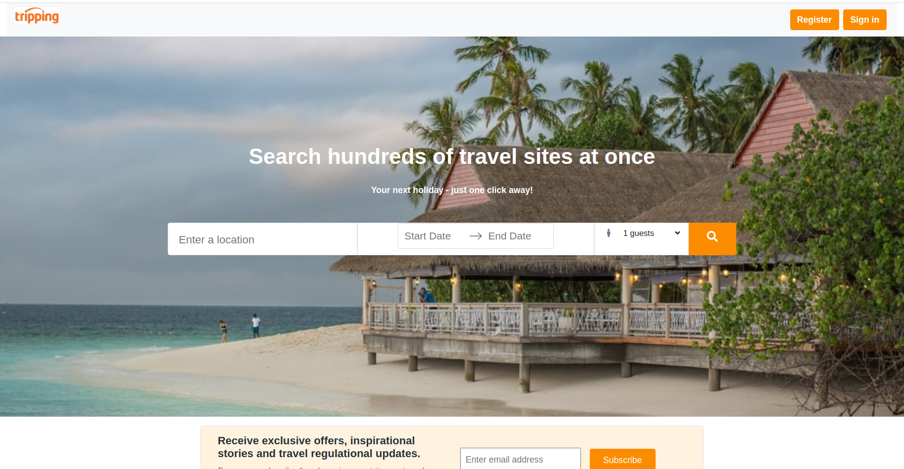

This project was created with React[Create React App](https://github.com/facebook/create-react-app).


## React Tripping Clone

React Tripping clone is inspired from Tripping website offering housing properties on rent for different destinations.

<p></p>

**Tripping Web link:**https://www.tripping.com/

**Tripping clone demo:** 

- [React Tripping clone](http://tripping.gunjan.tech/#/)
- location available to search: Texas

### :wrench: Tools Used
- [React](http://reactjs.org/)
- [Styled Components](https://www.npmjs.com/package/react-responsive-carousel)
- [Css](https://getbootstrap.com/)
- [Flask](https://flask.palletsprojects.com/en/1.1.x/)
- [MySql](https://www.mysql.com/)

## :v: Contributing
Great!, 
after cloning & setting up the local project you can push the changes to your github fork and make a pull request.

-----

**local development**
## Frontend React App

### Step 1: Clone The Repo

Fork the repository. then clone the repo locally by doing -

```bash
git clone https://github.com/Gunjan6788/tripping-clone.git
```

### Step 2: Install Dependencies

cd into the directory

```bash
cd Frontend
```

```bash
cd Tripping-app
```

install all the dependencies
```bash
npm install
```

### Step 3: Start Development Server

Then start the development Server
```
npm start
```
After running the development server the site should be running on https://localhost:3000

## Backend

### Step 1: Install virtual env

```
python3 -m venv venv
```
activate the virtual env
```
. venv/bin/activate
```

### Step 2: Install Requirements

install all dependancies
```
pip install -r requirement.txt
```

### Step 3: Create the database in MySql and upgrade the tables.
```
flask db init
```
```
flask db migrate
```
```
flask db upgrade
```
 
### Step 4: Run Flask in development

```
export FLASK_APP=server.py
```
```
export FLASK_Env=development
```
```
flask run
```


### Dependecies 

1. react-elastic-carousel
2. react-google-login 
3. email-validator 
4. password-validator 
5. query-string 
6. axios
7. react dates
8. react-airbnb date-picker 
9. react-router-dom
10. fecha
11. react-redux
12. react-google-maps
13. uuidv4
15. react-modal
16. react-star-rating-component
17. @material-ui/core/Slider
18. react-google-autocomplete
19. redux
20. redux-thunk

